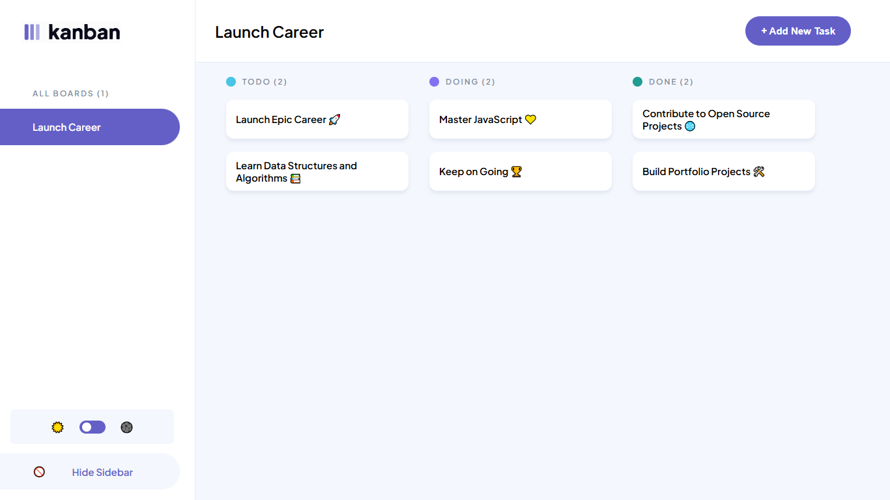
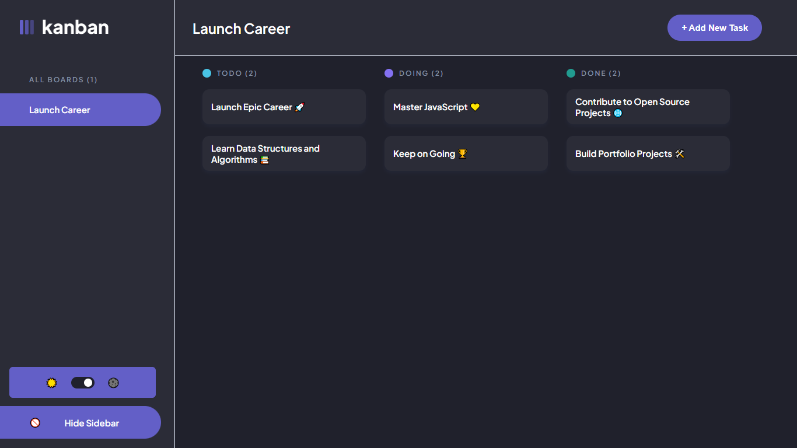
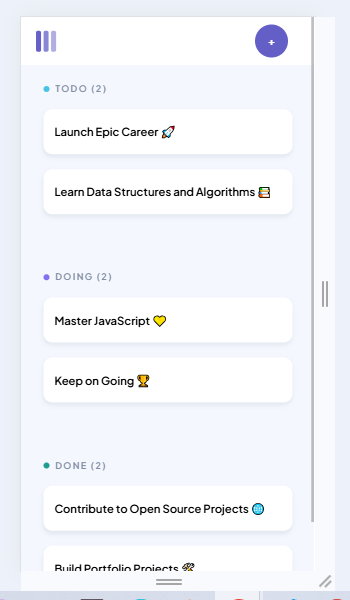
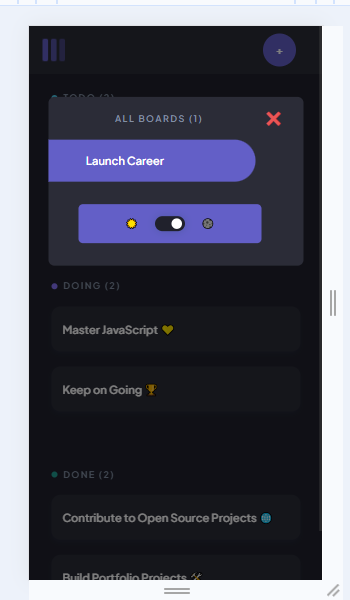
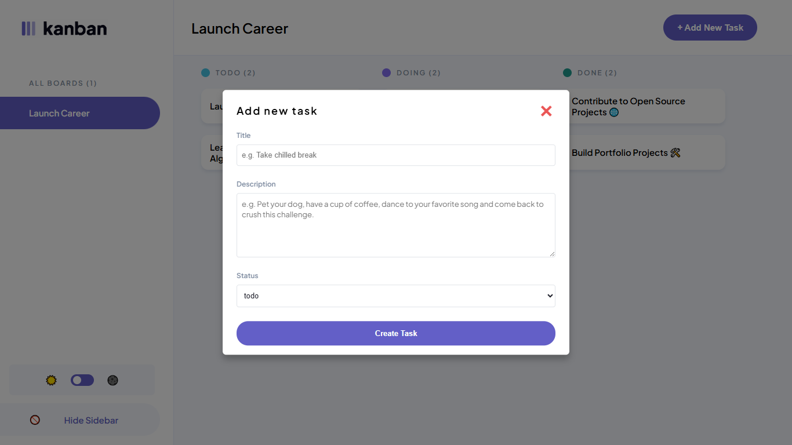
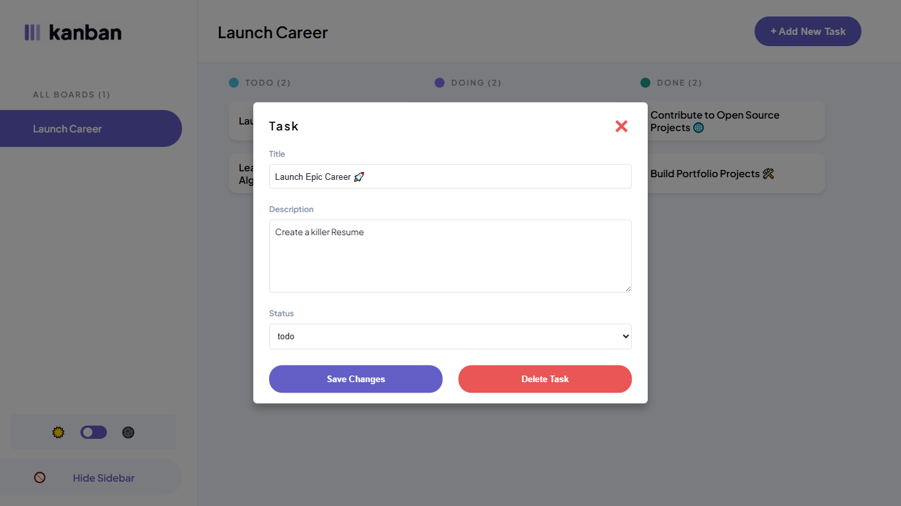

# JSL04 Project Brief: Dynamic Task Display & Modal View

---

## Table of Contents

- [📝 Project Overview](#project-overview)
- [🚀 Features](#features)
- [📦 Tech Stack](#tech-stack)
- [🛠️ Usage](#usage)
- [🔧 Setup & Installation](#setup--installation)
- [📸 Screenshots](#screenshots)
- [🧩 Contributing](#contributing)
- [🙋‍♂️ Contact](#contact)

---

<h2 id="project-overview">📝 Project Overview</h2>

This project dynamically displays tasks from a **given initial data** on the DOM using JavaScript. Tasks are placed into correct **Kanban board columns** based on their status. Clicking a task should open a **modal** where users can view and modify task details. The project emphasizes **DOM manipulation, event handling, modular JavaScript structure, and responsive UI implementation.** The design should match the **Figma** designs in the link.

[Figma Link](https://www.figma.com/design/y7bFCUYL5ZHfPeojACBXg2/Challenges-%7C-JSL?node-id=0-1&p=f&t=Ki0CZk0RAjrk9Fhs-0)

<hr style="border:0; height:2px; background:#ddd;" />

<h2 id="features">🚀 Features</h2>

**Loads Tasks Automatically**

- Tasks come from the data and go straight into “To Do,” “In Progress,” or “Done” columns. There is no hard coding needed.

**Easy Editing in a Modal**

- Click any task to open a popup where you can change the title, description, or status and then close it. You may delete the existing task as well.

**Create New Tasks**

- Click 'add new task' or '+' button to create a brand new task.

**Works on All Devices**

- The board and popup look good and work smoothly on both desktop and mobile screens.

**Clean, Organized Code**

- JavaScript is split into small, clear functions with helpful comments so it’s easy to read and maintain.

<hr style="border:0; height:2px; background:#ddd;" />

<h2 id="tech-stack">📦 Tech Stack</h2>

- HTML5
- CSS3
- JavaScript (ES6+)

<hr style="border:0; height:2px; background:#ddd;" />

<a name="usage"></a>

<h2 id="usage">🛠️ Usage</h2>

#### Use the Kanban board to:

- Organize your tasks into columns such as "To Do", "In Progress", and "Done"
- Track your workflow visually
- Manage small or large projects easily

<hr style="border:0; height:2px; background:#ddd;" />

<h2 id="setup--installation">🔧 Setup & Installation</h2>

#### 1. Clone the Repository

```bash
git clone https://github.com/tawandakasunzuma/TAWKAS25106_FTO2502_A1_Tawanda_Kasunzuma_JSL04.git
cd TAWKAS25106_FTO2502_A1_Tawanda_Kasunzuma_JSL04
```

#### 2. Install Dependencies

```bash
npm install
```

#### 3. Run the Local Server

```bash
npm start
```

<hr style="border:0; height:2px; background:#ddd;" />

<h2 id="screenshots">📸 Screenshots</h2>

#### Desktop (Light-mode & Dark-mode)




#### Mobile (Light-mode & Dark-mode (Popup))




#### Task Modals (Add new task & Edit current task)




<hr style="border:0; height:2px; background:#ddd;" />

<h2 id="contributing">🧩 Contributing</h2>

Contributions are welcome! To get started:

1. **Fork** the repository

2. **Create a new branch**

   ```bash
   git checkout -b feature/your-feature
   ```

3. **Commit your changes**

   ```bash
   git commit -m "Add your feature"
   ```

4. **Push to your branch**

   ```bash
   git push origin feature/your-feature
   ```

5. **Open a Pull Request** on Github

<hr style="border:0; height:2px; background:#ddd;" />

<a name="contact"></a>

<h2 id="contact">🙋‍♂️ Contact</h2>

For questions or feedback, reach out to:
📧 tskasunzuma@gmail.com
